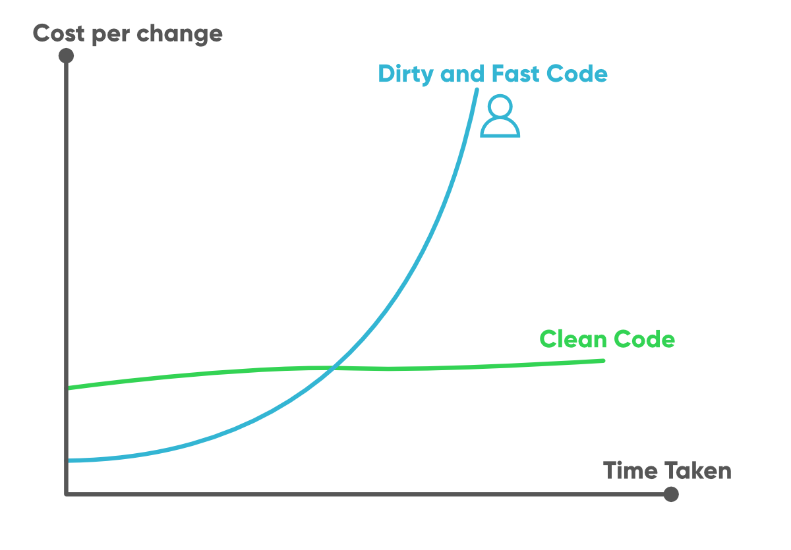

I’ve always hated coding standards. I thought to myself, why does it matter how my code looks if it works fine. As I developed as a programmer, I started to realize the importance of having some type of standards when programming. I started to collaborate on code and work on other people’s code. It was then that I noticed it was much easier to understand someone else’s code when they use descriptive names, organize their code in an efficient way, and indent properly. However, this is about where my expectations end. Spaces after commas, parentheses, and other places may make a code look pleasing, but to me provides no other benefits. I will not understand the code any better if there is a space after a comma or not. This is just one example of a coding standard that I find unnecessary.
Nevertheless, I do see the purpose of writing code in a standardized way. If multiple people work on the same piece of code, it may be a bit unpleasant if everyone uses their own format and styling. For this reason, When I contribute to a program I try my best to imitate whatever standard the person before me was using.

## Coding Standards in Class

One place I do not see the need for using a very specific coding standard is individual assignments done in a class. Unless the assignment is specifically to teach someone a coding standard, I think having students follow a standard to a high degree is not helpful. As long as the code is somewhat organized and understandable, I think whether or not the code meets a standard is a waste of time and energy. Professors may believe they are teaching students how to follow a standard, but when a student gets a job they may have to follow a different standard. Then, they will have to break the habits they developed following the standard in class to learn a different one for their job.
With that being said, I do not care for the ESlint analysis on Intellij I am using in a class. This analysis tool will warn a user about anything that doesn’t meet its standards. Because I am still learning the standard, this is highly annoying. I will get warnings and errors about things that won’t even affect how my program runs. This causes me to use a lot of my time editing my code to make it look “nice”.

## A Saving Grace

While writing this essay, I just remembered something I learned in a previous class: Code Cleanup. I’ve used an IDE similar to Intellij in my previous programming class and that professor taught me how to use a tool called Code Cleanup. This tool will go through your entire file and fix all the errors and warnings that are present. This tool is going to save me a lot of time moving forward because I will no longer have to focus on how my code looks, but just how it works.
