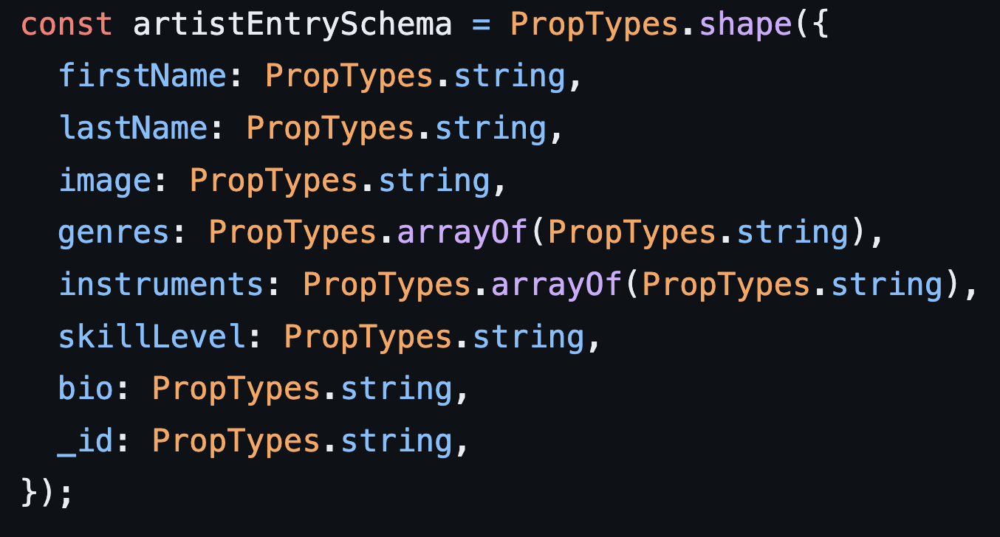

When I first learned about design patterns, I was in my ICS 314 class. We were assigned a task to create an application that allows users to create jam sessions. This made me think about how design patterns can be thought about like music notes. Each music note has a specific job or purpose and they may not be much alone, but after using many of them together one can create music. Or, in this case, an online application. Notes can be used in multiple places, or just in one just like design patterns. Overall, the application would be much harder to make and implement if it weren’t for the design patterns that were employed. This is just like how musicians may struggle to play or create a song without making use of musical notes.

## Jazzing up Jamb-UH-ree

We decided to name the application we were assigned, Jamb-UH-ree, and while making the application for the class many design patterns were implemented. One example of a design pattern that was used was a creational design pattern called a  builder. This can be seen in the following code:

This design pattern was used to fill the information needed in a certain artist’s card, which is like a short summary of their full profile. This design pattern has to be used for every artist that needs to be displayed on the application, which is all of the artists on the application. Creating the artist cards without this design pattern would have been an extremely tedious task. Doing it this way saved a lot of time and energy. This is just one example of a design pattern that was implemented in the code for the application. A similar situation arose when making jam session cards. A builder design pattern was used there too. In addition to these design patterns, many more were used in the creation of Jamb-UH-ree because they are a very useful tool that improves the efficiency of creating software.
