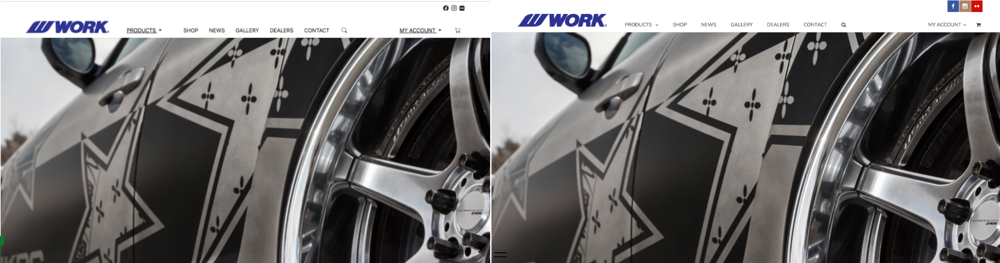

“Are you crazy?!” This was my first thought when I saw that my professor assigned an almost three hour video about using the UI framework Bootstrap 5. I was a bit frustrated with how long this video was, but in the end learning Bootstrap would save me more time than I could even fathom.

##A Small Price to Pay for Salvation

Three hours. I thought this was a ridiculous amount of time to put into learning Bootstrap 5. All to what? Make web pages look a little cooler? I thought that this was going to be a huge waste of time and energy, but boy was I wrong. When completing the first assignment using Bootstrap 5, I realized what a powerful tool it is. The assignment was relatively simple, but without Bootstrap or a different UI framework, I think it would have taken me way longer to complete. I don’t even know how I would go about making the website without Bootstrap 5. This realization was only strengthened as I completed more and more assignments that required us to use Bootstrap. I cannot even comprehend writing the pure html and css code for making these websites. But, here I was, creating them in a couple hours with the help of Bootstrap. Although learning Bootstrap may have been a bit painful, this pain would pale in comparison to writing all the html and css for the websites.

##Not all Sunshine and Rainbows

There’s no doubt Bootstrap 5 is an extremely useful tool that can save someone hours of time, but this doesn’t mean there isn’t a learning curve to it. There is a lot of information to intake when first learning Bootstrap 5, and I think it would be almost impossible to remember everything. So, I often must look up certain aspects of Bootstrap 5 and copy some reference code. Or, if I know I’ve done something similar in the past, I will refer to that code. I think remembering the key words for Bootstrap is difficult. For example, when making the navigation bar color using I’ve “bg-light” in the class to make the bar light. I don’t remember what bg means, and it is hard for me to remember these niche naming conventions.

##Proving Itself

Using Bootstrap, I was able to recreate a web page I found online. You can see the page I created on the left, and the original on the right. It is almost an exact copy, with some differences in spacing, font and icons, but overall the untrained eye would almost not be able to tell the difference. Completing this with just writing html and css code would be so much more difficult, I think it would probably take me days. In class we practiced making a website that was much simpler than this one using only html and css. Doing that was so much harder despite the website being much simpler. Overall, Bootstrap 5 makes creating web pages so much easier and user friendly. 

