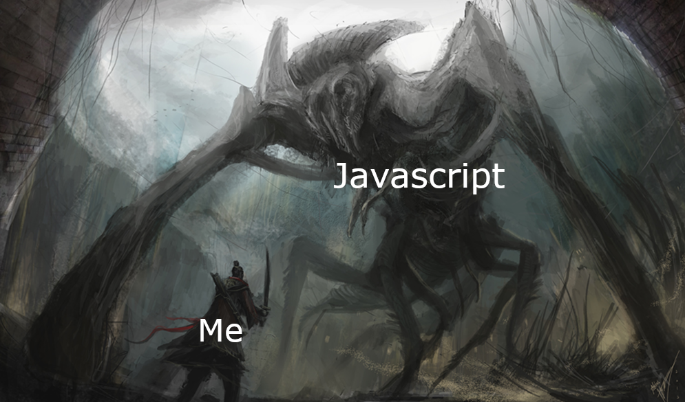

## From 0 to 100 Very Quickly

Before enrolling in this course, I had almost no experience with Javascript. The closest I’ve come to it was probably when I was searching for the answer to a coding problem and the only language I could find it in was Javascript. Now, after just one week in ICS 314, I’ve completed more than 140 exercises and feel like I know everything I need to know about the language.

## Another Day, Another Language

Learning Javascript was like learning any other language. I’ve learned Python, C, C++, and Kotlin, to name a few, and learning Javascript was no different. Sure, there are small differences in every programming language, but I’ve never really stuck with one language long enough to develop a preference for one over another. One day I’ll be using C for a class, and the next I’ll be using Python for a project. At the end of the day, they all seem fairly similar to me and I’ve adapted to using different languages. Even though Javascript is not strongly typed like the other languages I know, it hasn’t made that much of a noticeable difference so far in terms of the logic behind the coding. The syntax is slightly different. Learning the new syntax was quite tedious because the solutions to the exercises were so obvious, but to do it in this new language using a different syntax than I’m used to made it very annoying. However, other than that, almost all my prior coding abilities have seemed to carry over. Now, I just have one more language in my arsenal.

## Athletic Software Engineering? Better Start Going to the Gym

My first “Workout of the day” is soon and I couldn’t be more stressed. I’ve done both practice WODs, but one can only practice the same problem so many times. Once I’ve completed it once, it seems useless to me to do it again. I know the answer already, so it’s only a matter of typing it correctly. Despite this, I do think it may be an effective way to teach the material. Having students struggle through many practice WODs beforehand will prepare them well for the real thing. This stress is not very enjoyable to endure, and I assume as the semester progresses the WODs will only get harder, and I will get more stressed. Nevertheless, being stressed is not the end of the world. Every class that has challenged me has also stressed me, and these are the classes that I learn the most from, so I think being stressed is a small price to pay for the efficacy of this style of teaching.
