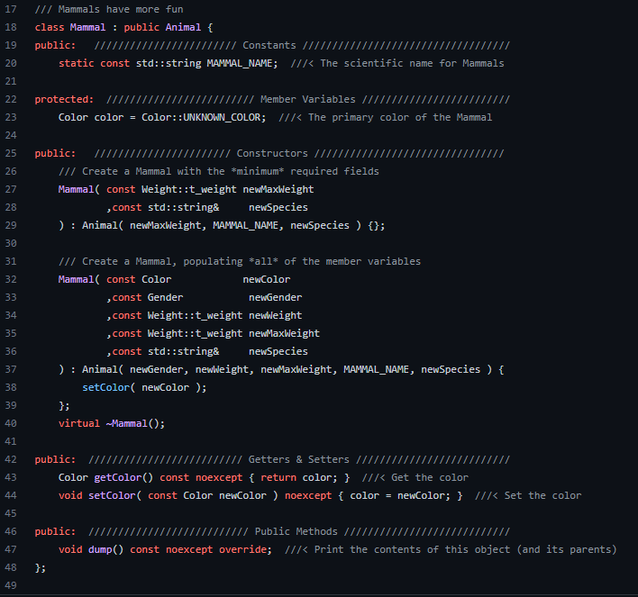

Animal Farm is a series of labs intended to teach the basics of C and C++. It's also intended to introduce good Software Engineering practices. Students are expected to "Live" in this project as the code evolves over a series of requirements.

Doing this project was an ongoing task for an entire semester. We constantly made changes as we learned to accomplish things in more efficient ways. We started the database by using arrays, which then evolved into structures. After that we implemented linked lists, singly and doubly, and finally moved onto binary search trees.

Aside from the technical skills I learned from doing this project, I also learned how to manage my time while doing a significant project. At the time of completion, it was by far the biggest project I had done. I learned I cannot always finish something all in one sitting, and it takes multiple long sessions to complete projects of this magnitude. This project changed the way I approach substantial assignments.

Here's an example of a class I had to make:

The databases GitHub: <a href="https://github.com/reidlum/ee205-animal-farm"><i class="large github icon "></i>https://github.com/reidlum/ee205-animal-farm</a>
