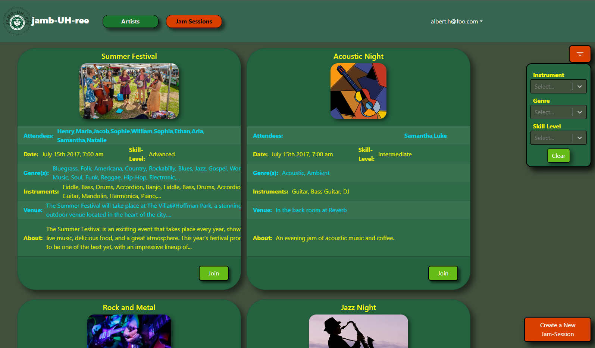
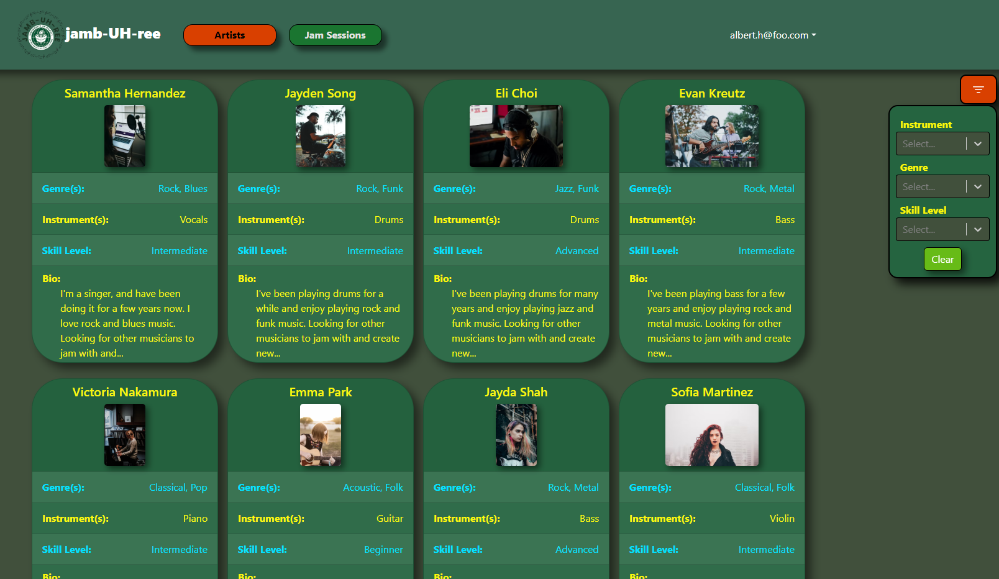

Musicians can have a hard time networking with each other. Finding others with similar tastes or skill levels is a problem that artists who want to collaborate with each other can face. Jamb-UH-ree is a solution for this problem for students at the University of Hawaii at Manoa. In this application users can make a profile that includes details about themselves that will allow them to connect with other artists and join or create jam sessions to meet up with them.

I worked with three other students on this project, and practiced Agile project management, version control, and of course our software engineering skills to develop the application. The application was created using JavaScript with Meteor React and Mongo.

Here are some screenshots from the app:

The application's GitHub Home page: <a href="https://jamb-uh-ree.github.io/"><i class="large github icon "></i>https://jamb-uh-ree.github.io/</a>
